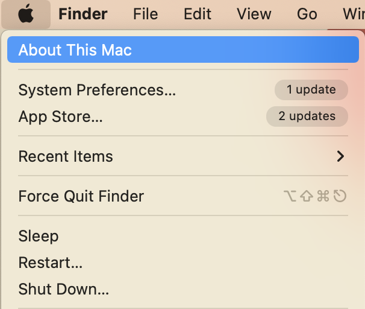
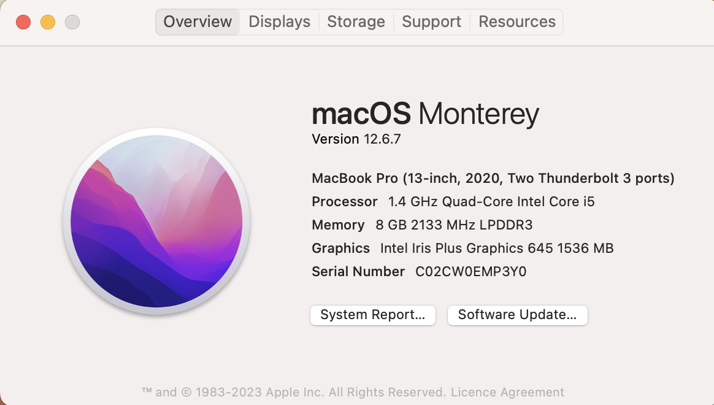
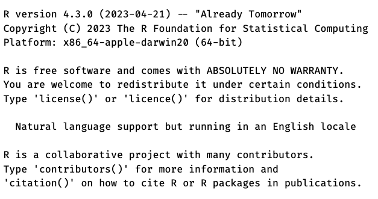
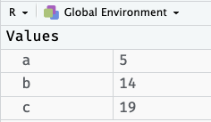
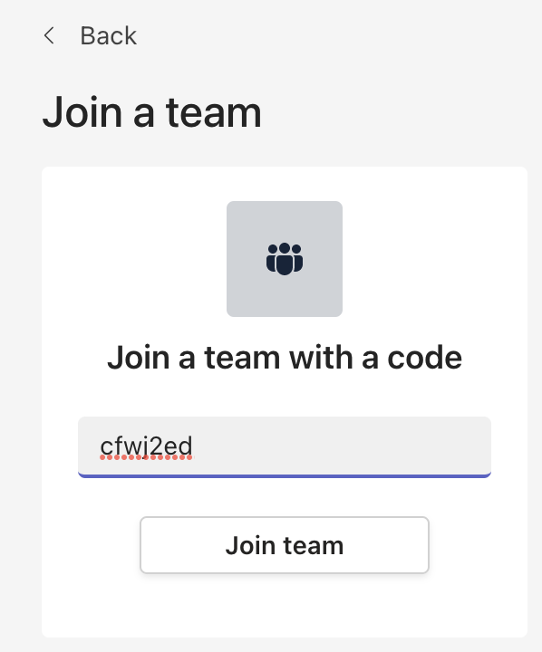
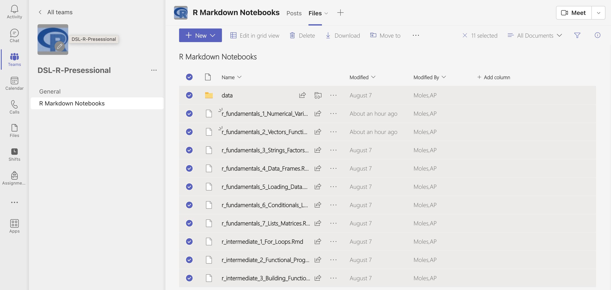
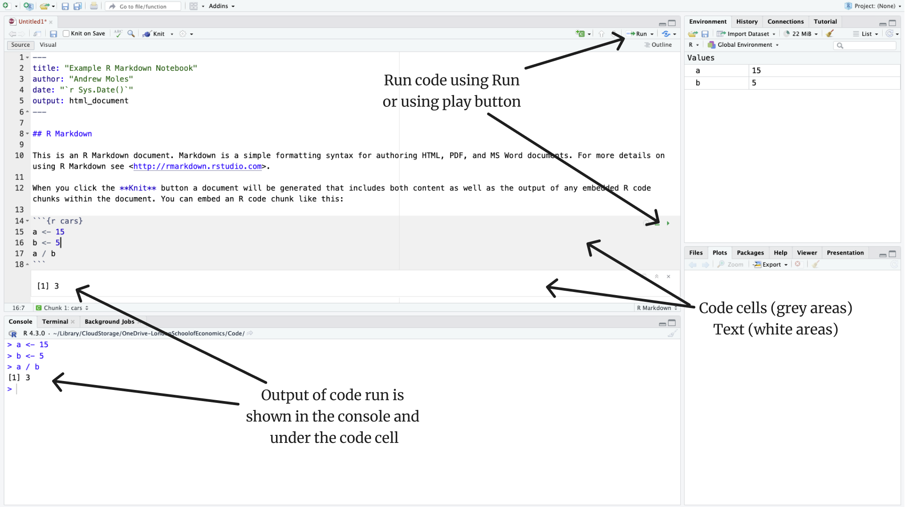

# Introduction to the pre-sessional for R

The pre-sessional for R is split into two stages. First, is this self-paced webpage tutorial, second is in-person workshops which are detailed in @sec-workshops.

This webpage tutorial contains instructions on how to install R on your laptop and some exercises to get you started with R. This tutorial must be completed before you join the in-person R pre-sessional workshops run by the Digital Skills Lab (DSL).

This tutorial and follow up in-person R pre-sessional workshops are part of your pre-sessional programme. They are designed to help you get up to speed with R which you will be using in your modules. Once you have completed this tutorial, see @sec-steps for information on what happens next.

## What do I need to do and who is this pre-sessional for?

1.  Use this self-paced tutorial to get R and RStudio installed, and get to grips with loading and using R scripts. This should take around **45 minutes to 1 hour** to complete

2.  Come to the in-person workshops, and complete 7 notebooks on Fundamentals in R (DSI Students should complete the full 10 notebooks). This will take approximately **7 hours** for the Fundamentals materials, and **10 hours** for the full series so we recommend you book and attend 3-5 sessions: [follow this link to book](https://apps.lse.ac.uk/training-system/userBooking/course/9999199)

    -   To save time at the start of the workshops, have a go at accessing the materials. See @sec-option for information

This tutorial is for all students who will be taking the following modules. It is strongly advised that you run through this self-paced webpage tutorial:

::: columns
::: {.column width="50%"}
-   MY360/361
-   MY451A
-   MY452A
-   MY464
-   MY470
-   MY472
-   MY452/552
:::

::: {.column width="50%"}
-   MY455/55/MY472
-   MY457/557
-   MY474/574
-   MY461/561
-   MY459/559
-   DS105
-   DS202
:::
:::

If you are on the following modules, it is advised that you come to the pre-sessional workshops, detailed in @sec-workshops, to get a better understanding of R:

::: columns
::: {.column width="50%"}
-   MY452/552
-   MY455/555
-   MY472
-   MY457/557
-   MY474/574
:::

::: {.column width="50%"}
-   MY461/561
-   MY459/559
-   DS105
-   DS202
:::
:::

## Tutorial Learning Outcomes

After having completed this tutorial, you will be able to:

-   Install R and RStudio
-   Run R code in the console
-   Open and run R scripts
-   Write code in R scripts

This tutorial is a step-by-step guide to get you started. Try not to skip any of the sections. You can use the table of contents on the right hand side to help you navigate sections.

::: callout-important
If you struggle with any of the steps from this tutorial, we recommend the following:

-   Come to the in-person R pre-sessional, as detailed in @sec-workshops, to get help and learn more about R. See @sec-booking for how to book
-   Seek support from our online 1-2-1 or drop-in advice, as detailed in the @sec-support section
:::

# Installing R and RStudio

The first stage of this tutorial is getting R and RStudio installed on your laptop so you can start using R! Below are step by step instructions for getting the software needed installed.

## Windows install

### Install R

-   To install R, you need to download the installer from the [R website](https://cloud.r-project.org/bin/windows/)

-   Click on either **base** or **install R for the first time**

-   Click on the **download R for Windows** link

-   Once downloaded, open the `.exe` file and follow the installation instructions on your computer

### Install RStudio

-   To install RStudio we download it from the [Posit website](https://posit.co/download/rstudio-desktop/)

-   Click on the **Download RStudio Desktop** link

-   Once downloaded, open the `.exe` file and follow the installation instructions on your computer

## Mac install

### Install R

To install R on your Mac you need to know the type of processor your Mac uses. This is straightforward to find out:

1)  On the top navigation bar on your Mac, click on the apple icon
2)  From the drop down menu, select *About This Mac*
3)  In *Overview* you will find the information about your Mac. If you have an *Intel Mac*, you will see the processor row, which has information that includes *Intel*. If you have an M1 or M2 Mac, you will see chip and M1/M2 in the *Overview* with something like *Chip Apple M1*

{width="49%"} {width="49%"}

#### M1 or M2 Mac

-   To install R, you need to download the installer from the [R website](https://cloud.r-project.org/bin/macosx/)

-   If you have a *M1 Mac* you will need click on the link the contains **arm64** to download R. It will look something like `R-4.3.1-arm64.pkg`

-   Once downloaded, open the `.pkg` file and follow the installation instructions

#### Intel Mac

-   To install R, you need to download the installer from the [R website](https://cloud.r-project.org/bin/macosx/)

-   If you have a *Intel Mac* you will need to click on the link that just contains the version of R. It will look something like `R-4.3.1.pkg`, and can be located a touch further down the page under the header **Binaries for legacy macOS/OS X systems:**

-   Once downloaded, open the `.pkg` file and follow the installation instructions

### Install XQuartz

To run R on a Mac operating system, XQuartz is required. You can install it by following [this link](https://www.xquartz.org/), downloading it and following the installation instructions.

### Install RStudio

-   To install RStudio we download it from the [Posit website](https://posit.co/download/rstudio-desktop/)

-   Click on the **Download RStudio Desktop** link

-   Once downloaded, open the `.dmg` file and follow the installation instructions on your computer

## Installing R and RStudio installation issues

If your installation for R and RStudio did not work, this is likely because your computer is running an older operating system. In these cases you will have to install an older version of the software.

It will be simplest, if you have faced installation issues, for you to come to a R pre-sessional workshop for support. See @sec-booking for more information on how to book.

# Why R?

LSE Methodology courses primarily use R. This is because R is a excellent tool for:

-   Statistics
-   Data handling (i.e. cleaning and manipulating data)
-   Visualisations, interactive graphics, and dashboards
-   Reporting (i.e. academic writing as well as building websites)

R is an open-source tool, which means you do not need to buy a licence in order to use it, and is a popular programming language, as shown in the PYPL index from 2023

{width="400" fig-align="center"}

Some cool things you can do in R:

{fig-alt="Animated gif of rainfall and temperature changes over time in Australian cities" fig-align="center" width="90%"}

{fig-alt="Regional map showing how each area of the UK is doing in terms of gender pay equality for each year data has existed from 2017-2023. " fig-align="center" width="75%"}

::: {.callout-tip collapse="true"}
## Fun side note

This webpage was built using R. If you are interested, come to the pre-sessional workshops and chat to one of the instructors about it!
:::

------------------------------------------------------------------------

# First steps with R

If you have not done so already, open RStudio!

**Windows users:**

-   Type `RStudio` in the search bar (bottom left, next to windows symbol)
-   If you prefer, open the start menu (click windows symbol), then scroll until you find RStudio

**Mac users:**

-   Hit command + space and type in `RStudio`
-   If you prefer to look for RStudio in an applications folder (open finder and select Applications on the left panel), you should be looking for this icon: 

When RStudio opens you should see a layout with 3 panels, similar to the image below.


The largest panel on the left with the `>` is the console. On the bottom right there is the files/plot panel, and top right is the environment panel.

If your installation of R and RStudio has worked, first RStudio should be open, and second you should see a message in your console panel telling you the version of R you have installed, like the image below.



There are three ways of running R code: console, scripts and R Markdown. In this tutorial we will cover the console and scripts.

The best way to get comfortable with a software is to start using it! We will run through series of exercises which will help you get more comfortable writing and running R code. The exercises include:

-   Performing some calculations using R
-   Convert your height from centimetres to feet and metres
-   Calculate body mass index (BMI) and waist-to-hip ratio

If you get stuck on the exercises, or would prefer to follow along with a video to solve the exercises, see @sec-solution.

## Exercise 1 - Running code from the console

The first thing we want to try is to run code from the console and see what happens. To run code from the console you type the code and press enter. Remember the console has the `>` symbol, and is the bottom left panel.

In RStudio, in the console, try the following calculations:

1)  Sum of 5 and 14
2)  Divide 9.6 by 1.6
3)  3 to the power of 12 subtracted from 4. *Hint: use brackets* `(x-y)^z`
4)  Divide 22 by 36 and multiply the result by 100
5)  The remainder of 55 divided by 2

The output for each question should be:

1)  [1] 19
2)  [1] 6
3)  [1] 512
4)  [1] 61.1111111111111
5)  [1] 1

|      Operator       | Symbol |
|:-------------------:|:------:|
|        Plus         |  `+`   |
|       Divide        |  `/`   |
|      Subtract       |  `-`   |
|      Multiply       |  `*`   |
|        Power        |  `^`   |
| Remainder (modulus) |  `%%`  |

: Table of some simple mathematical operators used in R to help you out {.striped .hover}

## Exercise 2 - Assigning variables (still in the console)

In R, when we want to keep data and re-use it later, we **assign** that data to a name. There are two ways of doing this. We can use the arrow like `<-` or the `=` symbol; the arrow is most commonly used in R.

If we wanted to **assign** our numbers from one of our previous calculations and use them for a new calculation we would do: `a <- 9.6` and `b <- 1.6`, then `a / b`. In this example, `a` and `b` are called *variables*.

In your console:

1)  Assign 5 to `a`
2)  Assign 14 to `b`
3)  Calculate the sum of `a` and `b`, and assign the result to `c`
4)  Type `c` and hit enter in your console. What happened?

In your *environment* panel, you should see: 

## Exercise 3 - Making a new R script

Scripts are a useful way of remembering what we have done previously, allowing us to save code and share it with others.

In this exercise we are going to open a script, and save it.

1)  We have a few options to open a script, the simplest is to use a shortcut: `shift + command/ctrl + N`. You can also open it manually by going the top left corner of RStudio, you should see a paper icon with a plus symbol. Click on it and select **R Script**
2)  Now the script is open, save the script as something like `r-pre-sessional.R`. There are a few ways of doing this, pressing `command/ctrl + s` is the simplest method
3)  Lets try and run some code. In this example, you want to convert your running time in minutes to seconds. In the script, type or copy the following code:


::: {.cell}

```{.r .cell-code  code-fold="false"}
# running time in minutes
run_minutes <- 26.34
# running time in seconds
run_seconds <- run_minutes*60
# print result
run_seconds
```
:::


4)  Now run the code! There are two main ways of doing this. First, we can highlight the code, and click the `Run` button near the top centre right of RStudio. Second, we can put our cursor on each line and use `command/ctrl + enter` to run the code line by line.
5)  The result of your code will appear in the console and should look like: [1] 1580.4

We will write more code in this script in the following exercise!

::: callout-tip
In the code example, we have hash tags (`#`). These are ***comments***, which allow us to write non-code information. This is helpful to document what each step is doing.
:::

## Exercise 4 - Height metrics conversion

In this exercise we are going to convert your height from centimetres to feet and meters. Below are some formulas to help you make the calculations in the exercises.

-   **centimetres to feet**: $heightcm X 0.0328084$

-   **centimetres to meters**: $heightcm / 100$

-   **feet to meters**: $heightft X 0.3048$

In the script we made in exercise 3, try the following exercises:

1)  Make a variable called `my_height`, and assign 195 as the height
2)  Convert the value of `my_height` from centimetres to feet. Make a new variable called `my_height_ft`, and assign the calculation of `my_height` from centimetres to feet
3)  Print your `my_height_ft` variable
4)  Convert the value of `my_height` from centimetres to meters. Make a new variable called `my_height_m`, and assign the calculation of `my_height` from centimetres to meters
5)  Print your `my_height_m` variable
6)  Convert the value of `my_height_ft` from feet to meters. Make a new variable called `my_height_ft_m`, and assign the calculation of `my_height_ft` from feet to meters
7)  Print your `my_height_ft_m` variable
8)  Now try and do the calculations for your own height, or an estimate if you are not sure! You can just change the value of `my_height`


::: {.cell}

:::


Using a value of `my_height` as 195cm, we would expect to get the outputs of:

-   centimetres to feet: [1] 6.397638
-   centimetres to meters: [1] 1.95
-   feet to meters: [1] 1.9500000624

::: callout-important
## What does *print* mean?

When we say *"print a value"*, which is to display the output of an object, we mean for you to type a variable and run it, such as typing `my_height` and pressing `command/ctrl + enter` to view the result in the console
:::

Remember, if you get stuck, try watching the video solution in @sec-solution.

## Exercise 5 - Loading R scripts

In the next two exercises we will be loading a pre-prepared script and doing some coding with it.

1)  Click on the Download R file button and save the file where you saved your other R script





2)  Now open the file into R. You should be able to use the file menu to achieve this: `File > Open File...`
3)  Within the file you should see some pre-written code. Run all the code
4)  What output appeared in the console? Assuming this person is a man, what would their health risk be according to the below table?

| **Health risk** |   **Women**    |    **Men**    |
|:---------------:|:--------------:|:-------------:|
|       low       | 0.80 or lower  | 0.95 or lower |
|    moderate     |   0.81-0.85    |   0.96-1.0    |
|      high       | 0.86 or higher | 1.0 or higher |

: Waist-to-hip ratio chart {.striped .hover}

In the next exercise, you will do another health related calculation, working out how to calculate body mass index (BMI)

::: callout-note
## What is waist-to-hip ratio?

The [waist-to-hip ratio](https://www.healthline.com/health/waist-to-hip-ratio#:~:text=0.9%20or%20less%20in%20men,0.85%20or%20less%20for%20women) metric is another measure of health that is designed to look for people at higher risk of conditions like heart disease or type 2 diabetes.
:::

## Exercise 6 - Body mass index (BMI) calculation

Use R to work out the body mass index (BMI) of someone who is 94kg, and 1.95m tall.

In the script we loaded in exercise 5:

1)  Assign the variables of weight and height
2)  Assign the variable of BMI, and calculate the BMI based of the weight and height variables
3)  Print the outcome
4)  Add comments on what each line of code is doing

You can find the formula for BMI on the [NHS website](https://www.nhs.uk/live-well/healthy-weight/bmi-calculator/#:~:text=The%20BMI%20calculation%20divides%20an,dividing%2070%20by%202.99%20%3D%2023.41)


::: {.cell}

:::


You should get an output of [1] 24.7205785667324

::: callout-tip
The height in this calculation should be in meters. For example, someone who is 170cm tall, would be 1.70m tall in meters.
:::

------------------------------------------------------------------------

# Note on R and RStudio

You might be asking yourself, why have I installed R ***and*** RStudio? Or why am I using RStudio and not just R?

An abridged answer to this question is R is the language we will be using, and RStudio is the environment in which we will be using R.

The unabridged answer is that R is a computer language, which means it cannot be opened like other computer applications such as an internet explorer (Chrome or Firefox) or Microsoft Word. Instead, to use R you write commands in the R language and ask your computer to interpret them. Previously, this would involve typing commands into a terminal application, or writing a script in a text editing software and running it through a terminal application. This is not the *easiest* way of writing R code, and is where RStudio comes in!

RStudio is an application, like Google Chrome or Firefox, which means it is easy to open on your computer. RStudio is a popular tool for using R, as it provides an pleasant interface for you to use R, with helpful features like the auto-completion, file management, and an environment panel to show/explore your data.

::: callout-tip
## What is the terminal?

The terminal is a program that you use to type in commands that are then executed by your computer's operating system. It is a text input/output environment
:::

------------------------------------------------------------------------

# Video solutions of exercises {#sec-solution}

To help with the exercises, we have a series of short video solutions made by the author of this tutorial.

You can either use these videos to follow along, or as a tool for finding the solutions to the exercises.

## Exercise 1 solution - Running code from the console


## Exercise 2 solution - Assigning variables (still in the console)


## Exercise 3 solution - Making a new R script


## Exercise 4 solution - Height metrics conversion


## Exercise 5 solution - Loading R scripts


## Exercise 6 solution - Body mass index (BMI) calculation


------------------------------------------------------------------------

# What are my next steps? {#sec-steps}

If you are on the modules shown below, it is recommended you attend the in-person pre-sessional training workshops the Digital Skills Lab (DSL) will be running through September to early October.

::: columns
::: {.column width="50%"}
-   MY452/552
-   MY455/555
-   MY472
-   MY457/557
-   MY474/574
:::

::: {.column width="50%"}
-   MY461/561
-   MY459/559
-   DS105
-   DS202
:::
:::

Students not on these modules are very welcome to join the in-person pre-sessional training, particularly if you have struggled to get R installed, found the exercises difficult, or want to get a better understanding of R.

## R Pre-Sessional in-person workshops {#sec-workshops}

The pre-sessional workshops are two hour long, in-person practical workshops to help you learn R. You will be working through practical exercises, designed to build your knowledge in R, while being supported by a team of data science trainers.

The content for these workshops will cover the key fundamental knowledge needed for using the R programming language. The content is split into worksheets which gradually progress you through topics.

Completing all the worksheets will take **around 10 hours** to complete.

These topics include, but are not limited to:

-   Working with different data types in R such as numerical, text, categorical, data frames (spreadsheet like data structures), matrices, and lists

-   Learning to manipulate these data types to extract what information you need, and perform operations on them

-   Using conditional operations to manipulate data

-   Using functions, built in code, to perform a wide array of operations like finding the mean

-   Loading datasets into R, and handling some common issues

-   Automating code, using tools like a for loop

-   Streamline your code by writing your own functions

{width="75%"}

These workshops will be run on a regular basis through September and early October.

| Date            | Time  | Location             |
|-----------------|-------|----------------------|
| 14th September  | 10-12 | LSE Life Workspace 4 |
| 15th September  | 10-12 | LSE Life Workspace 4 |
| 18th September  | 11-13 | LRB R.08             |
| 19th September  | 11-13 | LRB R.08             |
| 20th September  | 11-13 | LRB R.08             |
| 21st September  | 11-13 | LRB R.08             |
| 22nd September  | 11-13 | LRB R.08             |
| 26th September  | 1-3   | LSE Life Workspace 4 |
| 27th September  | 10-12 | LSE Life Workspace 4 |
| 29th September  | 10-12 | LSE Life Workspace 4 |
| 3rd October     | 10-12 | LSE Life Workspace 4 |
| 4th October     | 10-12 | LSE Life Workspace 4 |

: Dates, times, and location of R pre-sessional workshops

## Booking in-person workshops {#sec-booking}

**Attendance to the workshops is through booking only**. To book onto the workshops, you will need to [follow this booking link](https://apps.lse.ac.uk/training-system/userBooking/course/9999199)

::: callout-important
These workshops will be popular and there will be a maximum capacity. If you can no longer attend, please cancel your booking on the *Training and Development System* so another student can book.
:::

## What other support is available? {#sec-support}

Outside the pre-sessional workshops, the Digital Skills Lab will be running R workshops from October-December, then January-March, and again May-July.

There will also be drop-in advice and 1-2-1 services available throughout the year.

You can find out more information on the courses and support the Digital Skills Lab offers via [our webpage](https://info.lse.ac.uk/current-students/digital-skills-lab).

For help or other general queries please contact `digital.skills.lab@lse.ac.uk`.

------------------------------------------------------------------------

# Accessing and opening the in-person pre-sessional materials (optional extra) {#sec-option}

As an optional extra, you can prepare for the in-person workshops by accessing the materials for the workshops. Below is information and steps on how to do this.

## Access to the DSL-R-Presessional team on MS Teams

The materials for the workshops will be hosted/stored on MS Teams. They are R Markdown files.

1)  Go to the Teams overview in MS Teams, which can be accessed from the sidebar on the left.
2)  Select the **Join or create team** option on the top right.
3)  Enter the team code **cfwj2ed**
4)  Click Join Team.

{width="49%"} {width="49%"}

## Download the R Markdown files

1)  Go to the Teams overview in MS Teams, which can be accessed from the sidebar on the left.
2)  Select the DSL-R-Presessional team.
3)  Select the R Markdown Notebooks channel.
4)  Select the Files tab to access the R markdown notebooks.
5)  Select all items in the folder.
6)  Download the files. You might need to select the three dot icon to access the Download option.
7)  Click Download to download all R markdown notebooks as a zip file.

{width="90%" fig-align="center"}

::: callout-tip
### What is R Markdown?

An R Markdown file has sections of text and code together in a single document. This is helpful for tutorials, documentation, and writing reports.

An in-depth description can be found in the [R for Data Science](https://r4ds.had.co.nz/r-markdown.html) open source book
:::

## Opening the R Markdown files

Opening a R Markdown file is very similar to opening a script in R using `File > Open File...`. R Markdown files have the extension `.Rmd`.

## Using a R Markdown file

We are using R Markdown notebooks for these workshops as we can add text around code, which can help us guide you. The image below shows the basic layout of a R Markdown document.

{width="90%" fig-align="center"}

There are three ways to run code in a code cell. The two ways mentioned in the image (Run and play button), and third is to use `ctrl/command + Enter` to run each like just like you would with an R script.

The most important thing for you to take note of is the code cells. Each code cell is like a small R script. You'll notice the \`\`\` markings around the code cell. It is important these do not get deleted, so be careful when editing your code!

Finally, you can add your own code cell using `option+command+i` on a Mac or `ctrl + alt + i` on a Windows machine.

Throughout the notebooks you will come across exercises, with empty code cells for you to type your code into. Your task is to test out the examples, then try and do the exercises.

::: callout-note
If you have struggled with any of these steps, just come along to the workshops and ask a trainer for support
:::

------------------------------------------------------------------------

# Final remarks

This tutorial was written by the Digital Skills Lab (DSL) in support for the Methodology department and the Data Science Institute. We hope that you found it helpful in getting started with R.


::: {.cell}
::: {.cell-output-display}

:::
:::
